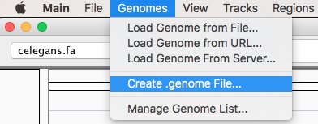
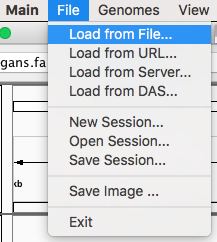
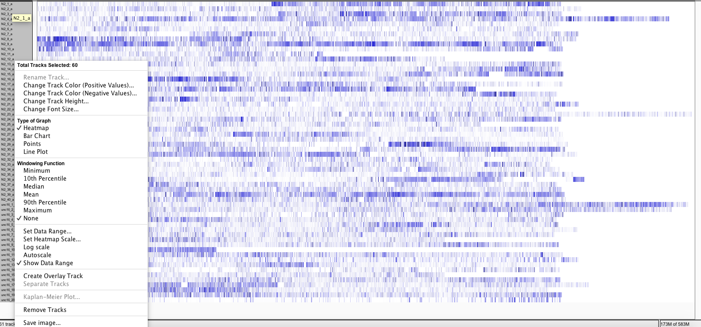
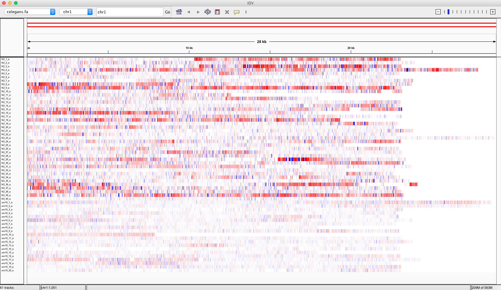

.. _quick_start: 

Quick start
===========

If you have to start using Pergola in some easy steps follow this guide.

.. note::

  This quick start guide assumes Pergola has been previously installed, if this is not the case follow instructions in
  :ref:`installation` section.

.. commented
.. _input-data:

.. *****************
.. Zenodo data
.. *****************

------------
Sample data
------------

A data set containing motion behavior from *C.elegans* data set is available on
`Zenodo <https://sandbox.zenodo.org/record/177697/files/celegans_speed_sample_data.tar.gz>`_.

************************
Sample data description
************************

The data set contains *C. elegans* motion measures derived from video recordings originally used on this
`work <https://www.nature.com/articles/nmeth.2560>`_.

The sample data set consists in two folders:  One named ``worm_speeds`` containing a ``CSV`` file for each of the
tracked worms. From the several measures that can be found in the individual files, in this example we will use mid-body
speed. The ``mapping`` folder contains the ``worm_speed2pergola.txt``, which sets the mappings between the information
represented in the worm_speed files and the pergola ontology. See :ref:`mapping-file` and :ref:`pergola-ontology` for a
deeper description.

*************
Get the data
*************

Two download the data set from Zenodo you can use this commands:

.. code-block:: bash

  mkdir data
  wget -O- https://zenodo.org/record/1161078/files/celegans_speed_sample_data.tar.gz | tar xz -C data

------------
Run Pergola
------------

********************
Pull Pergola image
********************

.. installation

.. note::

  If you want to install Pergola on your system instead, refer to :ref:`installation` documentation. And skip this
  section.

You can obtain last Pergola version from `Pergola Docker Hub repository <https://hub.docker.com/u/pergola/>`_.

.. code-block:: bash

  docker pull pergola/pergola:latest 
    
To launch Pergola image and mount the sample data set in the container you can type:

.. code-block:: bash
  
  docker run --rm -it -v "$(pwd)":/container_wd -w /container_wd pergola/pergola:latest bash

************
Execution
************

You can know process the downloaded sample data with Pergola using the following command:

.. code-block:: bash

  pergola -i ./data/worm_speeds/*.csv -m ./data/mapping/worm_speed2pergola.txt -f bedGraph -w 1 -min 0 -max 29000

The resulting files can be uploaded on a desktop browser for its visualization as explained below.

--------------
Visualization
--------------

*************
Download IGV
*************

As an example, we choose the `Integrative Genomics Viewer <http://software.broadinstitute.org/software/igv/>`_
to illustrate how to visualize data. IGV can be downloaded from
`here <http://software.broadinstitute.org/software/igv/download>`_.

****************
Create a genome
****************

After launching IGV, first you have to create a genome file. Go to **Genomes** menu and click on "Create .genome File..."
Data can be visualize using a heatmap.

On the menu that pops up load the fasta file generated by Pergola and click on OK.

.. image:: ./images/create_genome.png

********************
Load BedGraph files
********************

Now you can render the BedGraph files generated before by going to **File** menu and click on "Load from File..."

.. note:: 
  Stack the tracks corresponding to each group, in this manner differences will become easier to identify

*********************************
Set heatmap graphical parameters
*********************************

Finally to obtain a heatmap of the tracks it is necessary to set some options:

* To visualize all the tracks in the screen go to **Tracks** and click on "Fit Data to Window"

* Now select all tracks by clicking on their names and right click with the mouse, as a result a menu will pop up. On this menu check "Heatmap" under **Type of Graph** menu and "None" under **Windowing Function**. 

* To display the differences between the tracks, adjust heatmap settings as shown in the snapshot below.

.. image:: ./images/heatmap_menu.png

* The resulting rendering shows how overall the speeds of *unc-16* (uncoordinated strain), tracks below, are lower depicting a deficient moving behavior when compared to control (N2) strain on top.

