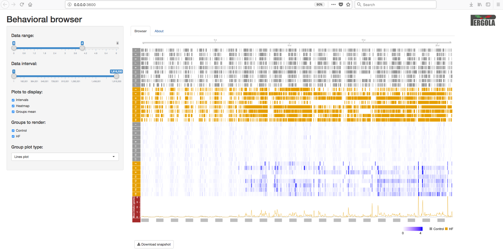
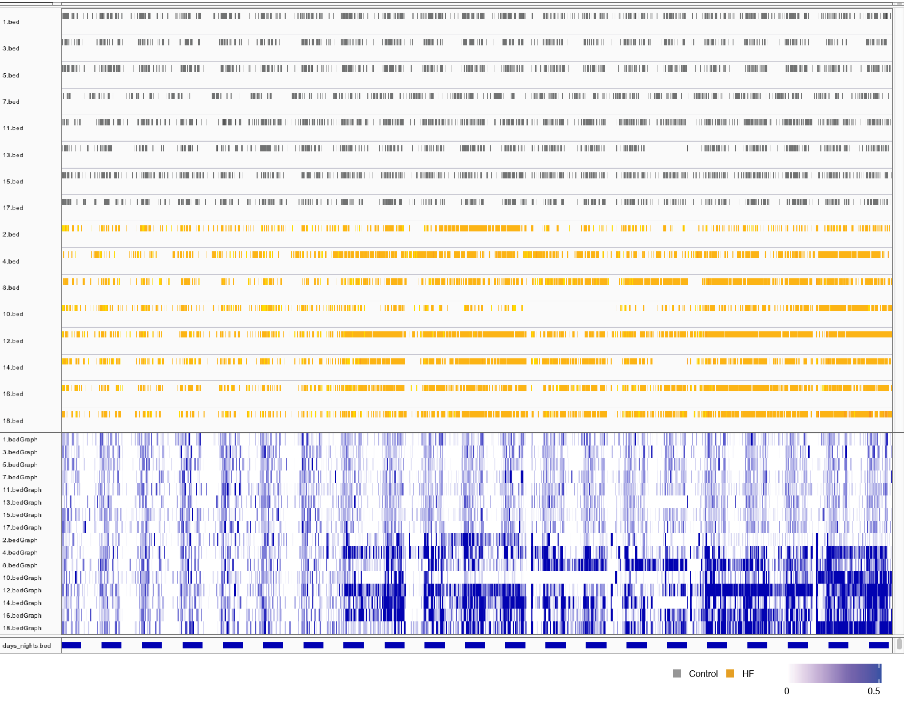
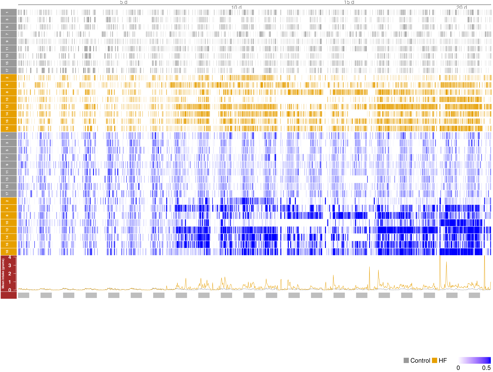

.. _visualization:

Visualization
===============

One of the main benefits of using Pergola is that it allows you to easily visualize longitudinal behavioral data using
ready-to-use genomic tools. Here you will find some examples of how to use these tools.

--------------
Shiny-pergola
--------------

Using several `Bioconductor`_ packages (Gviz, rtracklayer and GenomicRanges) and `Shiny`_ we created an ad-hoc browser
to visualize data. The code of this interactive web app can be found in our `GitHub repository`_.
We distributed Shiny-pergola as a `Docker image`_ to make easier its use. Read the following sections to learn
how to use Shiny-pergola Docker image.

.. _Bioconductor: https://www.bioconductor.org/
.. _Shiny: https://shiny.rstudio.com/
.. _GitHub repository: https://github.com/JoseEspinosa/shiny-pergola-docker
.. _docker image:

*************
Requirements
*************

Shiny-pergola needs Docker to be installed in your system. If you don't have Docker installed in your system you can
follow the instructions in :ref:`Docker-installation` section.

**********************
Get a sample data set
**********************

Besides, you need a data set to be displayed on the browser. If you want to give Shiny-pergola a try, you may want to
use our sample data set that consists in longitudinal behavioral recordings of mice feeding behavior processed with
Pergola. The data is host in Zenodo and can be download with the following command:

.. code-block:: bash

    mkdir data
    wget -O- https://zenodo.org/record/1162230/files/mouse__viz_shiny_pergola_sample_data.tar.gz | tar xz -C data
    cd data

*************
Pull image
*************

First thing you have to do is to pull Shiny-pergola Docker image from Pergola Docker Hub:

.. code-block:: bash

    docker pull pergola/shiny-pergola:0.1.1

*************
Run image
*************

Once you have downloaded the Shiny-pergola image you can launch it by executing:
You should be in the folder where you have untar the sample data.

.. code-block:: bash

    docker run --rm -p 3600:80 -v "$(pwd)":/pergola_data pergola/shiny-pergola:0.1.1 &

.. note::

    "$(pwd)" can be substitute by where you have untar the downloaded data

***************
Visualize data
***************

To visualize the data you just need to go to your web browser and type in your address bar the ip address returned
by the following command e.g. http://0.0.0.0:3600

----
IGV
----

The `Integrative Genomics Viewer <http://software.broadinstitute.org/software/igv/>`_ (IGV )is a widely-used, powerful
genomic desktop browser. You can use IGV to visualize longitudinal behavioral after converting the data to genomic
formats such as BED or BedGraph.

*************************
Get IGV official version
*************************

You can download IGV from `here <http://software.broadinstitute.org/software/igv/download>`_.

*************************
Get IGV adapted version
*************************

We adapted IGV to display time units instead of base pairs. This version of IGV is available for its download
`here <https://github.com/JoseEspinosa/IBB>`_ with detailed instructions of how to compile it.

****************
Create a genome
****************

After launching IGV, first you have to create a genome file. Go to **Genomes** menu and click on "Create .genome File..."
Data can be visualize using a heatmap.

.. image:: ./images/menu_create_genome.png

On the menu that pops up load the fasta file generated by Pergola and click on OK.

.. image:: ./images/create_genome.png

********************
Load files
********************

Now you can render your Pergola processed files by going to **File** menu and click on "Load from File..."

.. image:: ./images/load_files.png

*************************
Set graphical parameters
*************************

Finally to obtain a heatmap of the tracks it is necessary to set some options:

To visualize all the tracks in the screen go to **Tracks** and click on "Fit Data to Window"

.. image:: ./images/load_files.png

By right-clicking on tracks names a menu will pop up. On this menu you can choose between several options of how to
display your data. For instance, in the case of BedGraph files you can set with which type of graph they are rendered
(heatmap, lines plot, etc.).

***************
Visualize data
***************

This is an example of how you data will show up on IGV.

-----------------------
Bioconductor packages
-----------------------

You can use some of the Bioconductor libraries developed for the visualization of genomic information to render
behavioral data once processed with Pergola. `Bioconductor`_ is a software project that
for the analysis of genomic data developed in the `R programming language <https://www.r-project.org/>`_.
Some of these libraries provide nice functionalities for the programmatic visualization of data.

*********
Packages
*********

Among the available packages we have tried `Sushi <https://bioconductor.org/packages/release/bioc/html/Sushi.html>`_ and
`Gviz <https://bioconductor.org/packages/release/bioc/html/Gviz.html>`_. Both packages provide very nice capabilities to
visualize data, you can see below the result of visualizing the data using them in the :ref:`visualize_bioconductor`
section.

***************
Example scripts
***************

You can find an example of the scripts to load the data using Sushi on this
`link <https://github.com/cbcrg/mouse-pergola-reproduce/blob/master/bin/mice_sushi_visualization.R>`_ and a second
example using Gviz `here <https://github.com/cbcrg/mouse-pergola-reproduce/blob/master/bin/mice_gviz_visualization.R>`_.
In both cases the rendered data corresponds to the same data set.

***************
Visualize data
***************

The resulting Sushi visualization:

.. _visualize_bioconductor:

.. image:: ./images/mice_sushi_viz.png

Using Gviz, we obtained this visualization:

|
|

